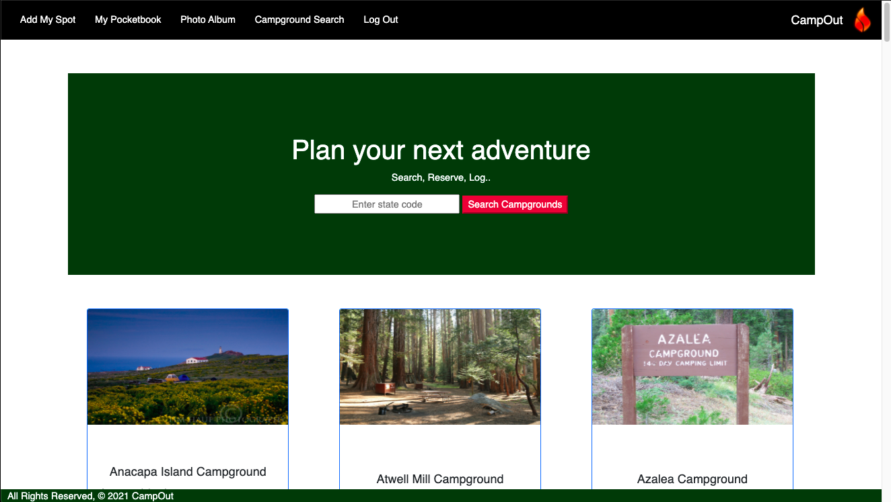

# CampOut
CampOut is an app where camping enthusiasts can search for campgrounds, find direct links to make reservations, log their trips, and share photos of their adventures.

# Technologies Used:
- Python
- Django
- PostgreSQL
- Boostrap
- Trello
- Lucidchart
- Amazon AWS
- Github
- HTML
- CSS
- Visual Studio Code
- Google Chrome DevTools

# Getting Started
This is a full-stack Django app using a PostgreSQL database that was built during my time in General Assembly's Software Engineering Immersive Program. It utilizes Djano's built in user authetication, and logged in users have full CRUD capabilities on one of three models. 

Check it out [here](tbd)

For a peek into the planning process, my Trello board can be viewed [here](https://trello.com/b/j4wrZBt4/campout)

# Biggest Takeway
I feel as though I have gained a more thorough understanding of how learning the ins and outs of one programming language, can make learning many different languages a much smoother process. 
I also got to explore the very tip of what Python is capable of, and I'm very excited to explore it further! 

# Next Steps
- Add React to the front-end for a more dynamic user experience 
- Add "likes" to photos in the public photo album
- Allow users to delete photo's they upload, and only photo's they upload
- Allow campgrounds from the external API call to be saved in a users Pocketbook that they can then plan trips around
